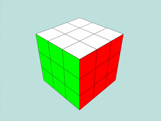
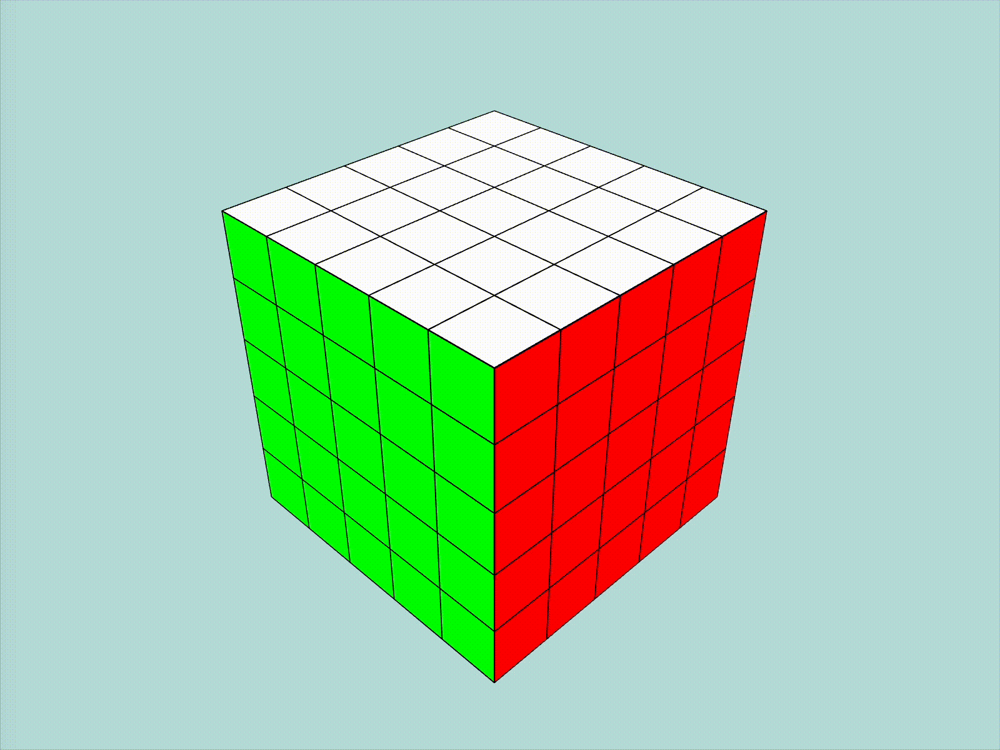
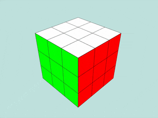

# Rubik's Cube Visualizer

[](https://github.com/ogi02/Rubik-s-Cube-Solver/actions)

A Typescript-based web visualizer for Rubik's Cubes, allowing users to visualize cube states and rotations interactively.

---

## Installation

Clone the repository, install the requirements and run the visualizer in development mode:

```bash
git clone https://github.com/ogi02/Rubik-s-Cube-Solver.git
cd Rubik-s-Cube-Solver/visualizer
npm install
npm run dev
```

## Example Usage

The visualizer is designed to work with websocket messages to visualize cube states and apply moves.
It is dependent on a client that sends the appropriate messages. It cannot function standalone.

### Visualizing Cube States

The visualizer supports receiving the state of a cube via a websocket connection.

#### 3x3x3 Cube

Message:
```json
{
    "type": "cube_state",
    "data": {
        "dimensions": 3,
        "state": {
            "UP": [
                "B", "R", "G",
                "R", "W", "B",
                "Y", "W", "Y"
            ],
            "DOWN": [
                "Y", "B", "W",
                "W", "Y", "G",
                "Y", "W", "W"
            ],
            "LEFT": [
                "R", "Y", "O",
                "B", "O", "O",
                "B", "O", "G"
            ],
            "RIGHT": [
                "O", "W", "R",
                "O", "R", "O",
                "O", "Y", "O"
            ],
            "FRONT": [
                "B", "R", "G",
                "B", "G", "G",
                "R", "Y", "G"
            ],
            "BACK": [
                "W", "G", "W",
                "Y", "B", "R",
                "B", "G", "R"
            ]
        }
    }
}
```

Output:


#### 5x5x5 Cube

Message:
```json
{
    "type": "cube_state",
    "data": {
        "dimensions": 5,
        "state": {
            "UP": [
                "G", "G", "Y", "Y", "W",
                "Y", "B", "G", "W", "R",
                "G", "R", "W", "Y", "Y",
                "B", "W", "O", "G", "W",
                "Y", "W", "O", "Y", "G"
            ],
            "DOWN": [
                "B", "O", "Y", "O", "B",
                "R", "R", "W", "G", "G",
                "R", "Y", "Y", "G", "O",
                "W", "B", "O", "Y", "O",
                "W", "R", "R", "Y", "W"
            ],
            "LEFT": [
                "R", "G", "Y", "O", "O",
                "B", "O", "R", "O", "W",
                "W", "Y", "O", "W", "R",
                "R", "R", "B", "B", "O",
                "O", "B", "G", "W", "Y"
            ],
            "RIGHT": [
                "Y", "B", "B", "Y", "B",
                "G", "O", "B", "Y", "R",
                "O", "W", "R", "R", "B",
                "Y", "W", "O", "Y", "Y",
                "W", "R", "G", "Y", "R"
            ],
            "FRONT": [
                "B", "O", "W", "R", "O",
                "G", "O", "R", "W", "R",
                "W", "B", "G", "G", "B",
                "G", "R", "O", "G", "G",
                "R", "G", "R", "W", "R"
            ],
            "BACK": [
                "O", "O", "O", "W", "Y",
                "B", "Y", "Y", "G", "O",
                "W", "B", "B", "W", "G",
                "B", "B", "G", "R", "W",
                "G", "B", "B", "B", "G"
            ]
        }
    }
}
```

Output:


### Applying Moves

The visualizer supports receiving a series of moves to apply to a cube via a websocket connection.

#### 3x3x3 Cube

Message:
```json
{
    "type": "apply_moves",
    "data": {
        "moves": [
            "D2", "B2", "R'", "L'", "D", "R", "U2", "D", "L2", "U'",
            "F'", "L'", "D'", "L", "F", "L", "B2", "F'", "R", "F2"
        ]
    }
}
```

Output:


#### 5x5x5 Cube

Message:
```json
{
    "type": "apply_moves",
    "data": {
        "moves": [
            "Uw", "Dw'", "U", "D2", "Fw'", "L'", "D'", "F'", "R", "Lw",
            "D'", "Bw'", "F2", "Dw'", "B", "Rw'", "D", "Bw2", "Dw2", "U'",
            "F2", "L2", "Fw2", "Bw2", "B2", "R2", "F'", "L", "Bw'", "D",
            "Lw", "U", "F'", "U", "F'", "U2", "Bw", "Fw", "U", "Dw2",
            "D'", "Uw", "Lw'", "Bw2", "Dw", "R'", "Uw", "R", "F2", "D2",
            "R", "D", "U", "Lw", "Rw'", "Bw'", "Lw2", "Uw2", "Dw2", "L'"
        ]
    }
}
```

Output:


### Changing Move Speed and Delay

The visualizer can be configured to apply moves with different speeds and styles.
Speed is percentage of the move for a single frame - 100 means the move is applied in a single frame, 50 means the move is applied in two frames, etc.
Move delay is the time in milliseconds to wait between moves. The formula `moveDelay = 1000 / moveSpeed` provides a visually appealing speed for the different speeds.

#### 3x3x3 Cube with Normal Speed and Delay

```text
Move Speed: 8
Move Delay: 125
```

Output:


#### 3x3x3 Cube with Fast Speed and Small Delay

```text
Move Speed: 50
Move Delay: 20
```

Output:


## Testing
Test the build of the project:

```bash
npm run test
```

## Contact
Author: [Ognian Baruh](https://github.com/ogi02)  
Email: [ognian@baruh.net](mailto:ognian@baruh.net)